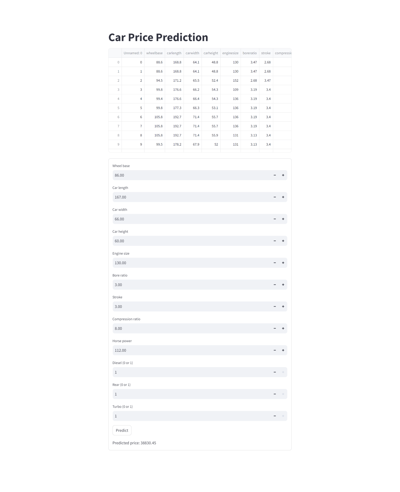

<h1>Car price prediction using Linear Regression</h1>
<h2>Description of the project</h2>
  
It takes characteristics of car which are wheel base, car length, car width, car height, engine size,
       bore ratio, stroke, compression ratio, horse power, 
       diesel, rear and turbo to predict the price of the given car.

<h2>Output in streamlit</h2>

